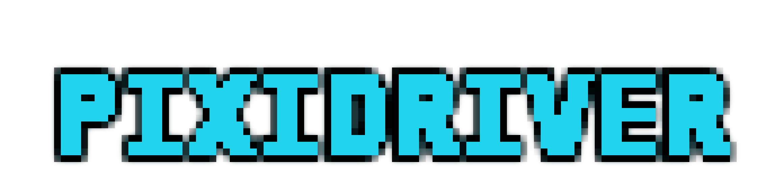
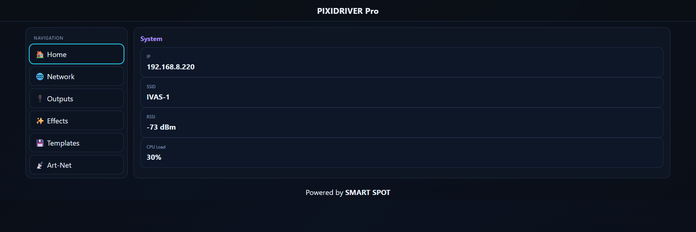
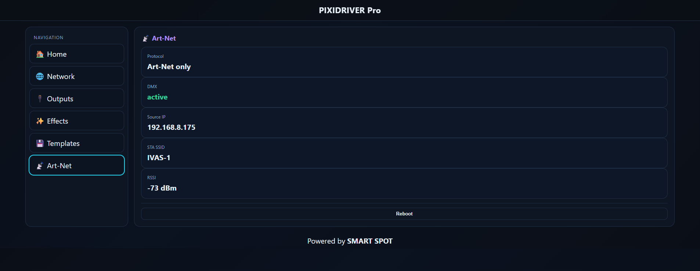
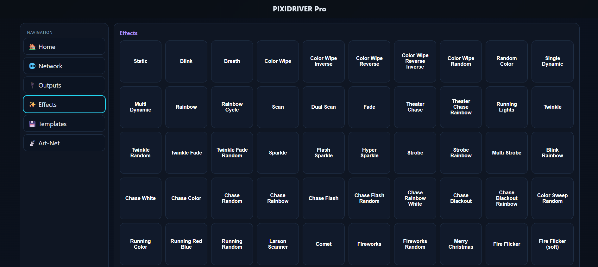
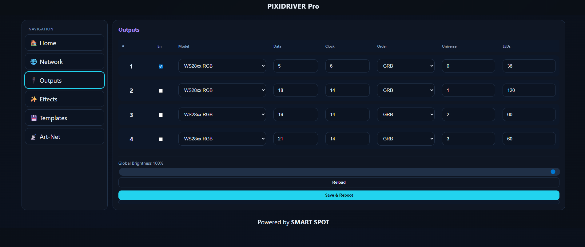
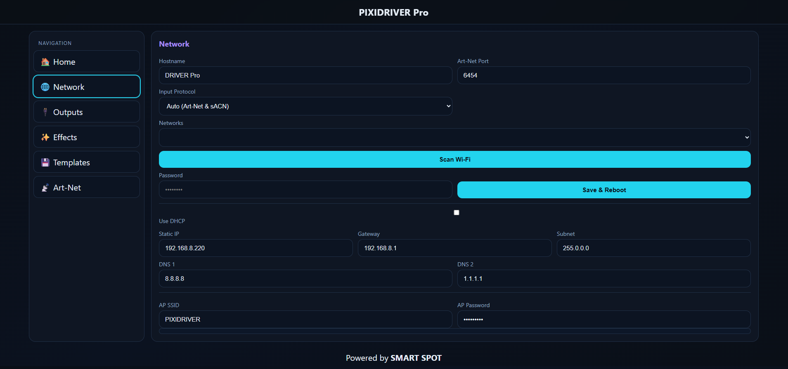
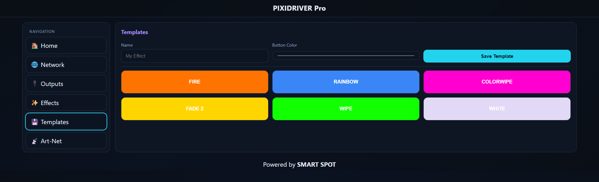

# PIXIDRIVER — Art‑Net/sACN LED Pixel Controller Beta

> High‑performance multi‑port pixel controller with a fast Web UI, frame‑sync anti‑flicker, and one‑click Scenes. Built for shows. ⚡️

[](#-getting-started)
[](#-art-net--sacn)
[](#-led-models--ports)
[](#-license)

<p align="center">
  
</p>

---

## ✨ Highlights

- **Art‑Net & sACN (E1.31)** input with per‑port universe mapping  
- **Frame‑sync anti‑flicker**: `show()` waits for full universe set or timeout → clean, stable frames  
- **Multi‑port** output on ESP32 — drive multiple LED strips in parallel  
- **Fast Web UI** (mobile & desktop) with Effects and **Scenes** (one‑tap presets)  
- **WS2812FX effects** + solid color + speed/mirror controls  
- **Global Brightness** slider with smooth updates  
- **Templates & Scenes**: save/load presets (effect, color, speed, mirror, output)  
- **Network**: STA/AP, RSSI, Source IP, protocol status  
- **Lightweight HTTP API** for integrations/automation

> Designed to be practical on stage: plug in, map universes, no flicker, no drama.

---

## 📸 Screenshots

> Replace these placeholders with real screenshots from your device (put images in `docs/`).








---

## 🧰 Hardware

- **MCU**: ESP32 (recommended)  
- **LEDs**: WS2812B / SK6812 (RGBW), APA102, LPD8806  
- **Power**: match LED voltage/current; inject power on long runs  
- **Level shifting**: recommended for 5V LEDs

> ⚠️ Large arrays draw serious current. Use fuses, proper gauge, and plan for voltage drop.

---

## 🚀 Getting Started

### Option A — Arduino IDE

1. Install **ESP32 Arduino core**.  
2. Libraries (Library Manager or GitHub):
   - `Adafruit_NeoPixel`
   - `WS2812FX` (if using FX)
   - `Preferences` (part of ESP32 core)
   - `ArduinoJson` (or compatible JSON lib)
   - `WebServer` (part of ESP32 core)
3. Open the firmware sketch (e.g. `firmware/PIXIDRIVER_Pro_*.ino`).  
4. Select your ESP32 board + COM port.  
5. **Upload**.

### Option B — PlatformIO

Create `platformio.ini` in your repo root:

```ini
[env:esp32]
platform = espressif32
board = esp32dev
framework = arduino
monitor_speed = 115200
lib_deps =
  adafruit/Adafruit NeoPixel
  kitesurfer1404/WS2812FX
```

Then:
```bash
pio run -t upload
```

### First boot

- If device starts in **AP**: connect to its SSID, then open `http://192.168.4.1`  
- If device joins **Wi‑Fi (STA)**: check your router/DHCP for the IP, or use Serial Monitor to read it.

### Web UI overview

- **Home**: live status, Global Brightness  
- **Art‑Net**: protocol, DMX active/idle, source IP  
- **Effects**: WS2812FX grid (tap to apply)  
- **Scenes**: one‑tap presets (10 × 3)  
- **Templates**: save/load/rename/delete  
- **Network**: Wi‑Fi settings, RSSI, IP  
- **System**: firmware info, reboot, backup/restore (if present)

---

## 🌈 Art‑Net & sACN

- **512 channels per universe** (DMX standard)  
- Per‑port mapping: start universe, LED model (RGB/RGBW), color order, LED count  
- **Frame‑sync anti‑flicker**: waits for all universes (or small timeout ~30 ms) before `show()`  
- Prefer **unicast** for reliability.

---

## 🔌 LED Models & Ports

- Model: RGB or RGBW (WS2812B/SK6812) or clocked (APA102/LPD8806)  
- Color order: GRB/RGB/…  
- Bytes per pixel: RGB=3, RGBW=4  
- Pixels per DMX universe: RGB ≈ 170, RGBW = 128

---

## 🧪 Effects & Scenes

### Effects (WS2812FX)

Pick an effect, set **Color**, **Speed**, optional **Mirror**, choose **Outputs**.

### Scenes

Save a full look: **effect + color + speed + mirror + output(s)**.  
Recall instantly from **Scenes** grid (up to 30 scenes).

> *Note:* Scene persistence depends on your build (NVS/Templates enabled).

---

## 🖥️ HTTP API (common endpoints)

> Exact endpoints may vary slightly by build.

- **State**: `GET /state` → JSON status  
- **Brightness**: `POST /brightness` with `{"value":0..255}`  
- **Pattern**: `POST /pattern`
  - color: `{"action":"color","output":"all","color":"#RRGGBB"}`
  - speed: `{"action":"speed","value":80}`
  - start/stop: `{"action":"start"}` / `{"action":"stop"}`
- **Templates**:
  - list: `GET /templates/list`
  - save: `POST /templates/save` with `{"name","button","effect","color","speed","mirror","output"}`
  - load: `POST /templates/load` with `{"slot":idx}` (or `/templates/load/<idx>`)
  - delete: `POST /templates/delete` with `{"slot":idx}` (or `/templates/delete/<idx>`)
- **System**: `POST /reboot`

---

## ⚙️ Configuration Notes

- Brightness/color updates are scheduled via the frame‑sync path to avoid tearing.  
- Global Brightness can be persisted to **NVS (Preferences)** (if enabled in your build).

---

## 🧱 Repo Structure

```
/docs/                     # images used in README
/firmware/                 # .ino and sources
  PIXIDRIVER_Pro_*.ino
LICENSE
README.md
platformio.ini
```

---

## 🔧 Troubleshooting

- **Flicker while moving brightness** → use a build where brightness change schedules into the frame‑sync (no direct `show()` per step).  
- **Hue jumps at release** → ensure color updates are coalesced and synced; prefer unicast on your network.  
- **Wrong colors** → check color order (GRB/RGB/…).  
- **No data** → confirm subnet/IP, unicast target, and start universe mapping.

---

## 🤝 Contributing

PRs welcome! Keep hot paths non‑blocking and include notes for any timing‑sensitive changes.

---

## 📜 License

MIT — see [LICENSE](LICENSE).

---

## 🙌 Credits

- WS2812FX — effects engine  
- Adafruit NeoPixel — LED driver  
- WLED — inspiration for UX & community spirit  
- SMART SPOT — design & project lead

<p align="center">
  Powered by <a href="https://github.com/smartspot-led/PIXIDRIVER-V1.0"><b>SMART SPOT</b></a>
</p>
